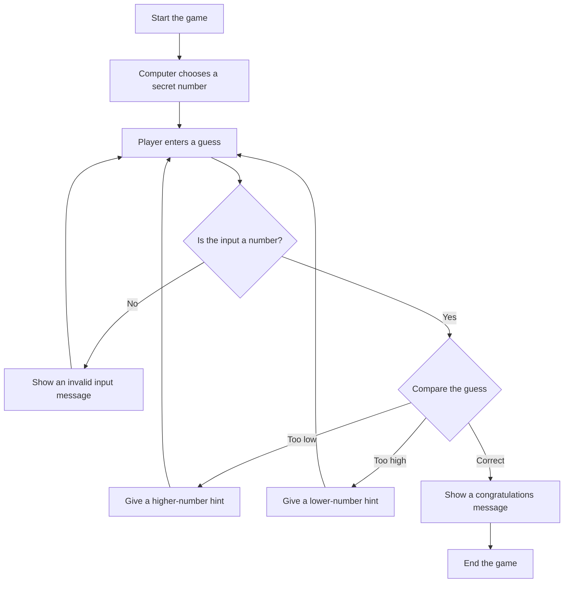

# Find Random Number

Find Random Number is a small Python guessing game. The program chooses one
secret number from 1 to 1000, and the player tries to guess it.

## Features

- Chooses a random number between 1 and 1000.
- Asks the player to enter a guess.
- Validates that the input is a number.
- Gives a hint when the guess is too low or too high.
- Prints a success message when the correct number is found.

## Requirements

- Python 3.x

No extra packages are required. The project only uses Python's built-in
`random` module.

## How To Run

Run the game:

```bash
python3 find_number.py
```

## How To Play

1. The program chooses a secret number.
2. You enter your guess after the `Enter a number:` prompt.
3. If your guess is too low, the program tells you to try a higher number.
4. If your guess is too high, the program tells you to try a lower number.
5. When you guess correctly, the game prints a congratulations message and ends.

## Visual Explanation

The diagram below shows how the program works:



## Video Explanation Script

You can use this short script when recording a video explanation:

1. Open `find_number.py` and explain that `random.randint(1, 1000)` chooses the secret number.
2. Run the program in the terminal with `python3 find_number.py`.
3. Enter a few wrong guesses and explain how the hints help the player.
4. Enter the correct number and show the `Congratulations!` message.
5. Explain that `break` stops the loop after the correct answer.

## Example

```text
Enter a number: 500
The secret number is higher. Try again!
Enter a number: 750
The secret number is lower. Try again!
Enter a number: 620
Congratulations! You found the secret number!
```

## Project Structure

```text
.
├── README.md
└── find_number.py
```

## Author

This project was created to practice basic Python concepts.
